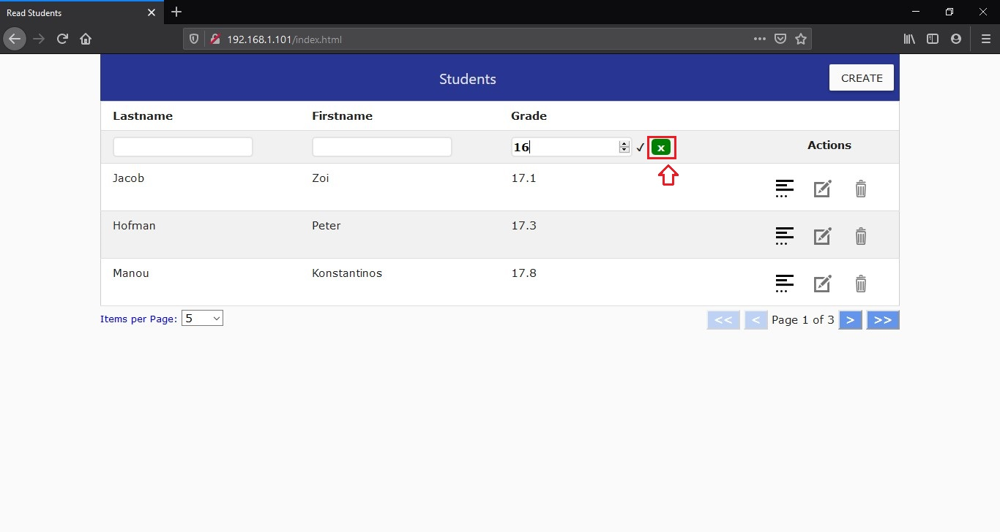

# Web App for students with AngularJS

## Contents
* [Introduction](#anchor1)
* [Web App Main Functionalities](#anchor2)
* [Usage instructions with screenshots for the Angular-based Frontend](#anchor3)
  1. [Creating a new student](#anchor4)
  2. [View detailed information about a student](#anchor5)
  3. [Editing a student](#anchor6)
  4. [Deleting a student](#anchor7)
  5. [Filtering records by firstname and/or lastname and/or above a certain grade](#anchor8)
  6. [Ordering records by firstname or lastname or grade](#anchor9)
  7. [With or Without Pagination](#anchor10)
* [Usage instructions about the Slim-based RESTful API](#anchor11)
* [How deploy the web app and configure Xampp](#anchor12)
  1. [Deploying the frontend](#anchor13)
  2. [Deploying the RESTful API](#anchor14)
  3. [Deploying the database](#anchor15)

##  Introduction
It's about a simple web application that stores, edits and shows some information about the students of a class. The current implementation makes use of AngularJS as a frontend so as to be built a web-based user interface that simulates the main interactions of inserting, updating and deleting student records. Except for AngularJS, HTML and CSS are also needed for this user interface.

On the backend (server-side), a RESTful API has been built by using the Slim PHP framework for implementing the main interactions with a MySQL database. These basic interactions involve getting one or all students, creating a new student, as well as updating and deleting an existing one. Also, some extra interactions were created, such as the filtering or ordering of students by some of their attributes. However, these final ones were not used on the client side. The testing of this API was done through trials and errors by making use of the Postman tool.

Finally, the cross-platform XAMPP package (v7.2.12) was installed and used locally for the testing and deployment purposes of the Angular-based web app as well as for the Slim-based RESTful API. The package contains the useful to the development elements: 1) HTTP Apache (v2.4.37) for Web Server, 2) MariaDB (v10.1.37) as Database Server, and 3) an interpreter for the PHP (v7.2.12) server-side scripting language.

These simple angular-based web app and RESTful API were assigned and implemented as a project during my post-graduate studies in Engineering and Pervasive Computing Systems.

##  Web App Main Functionalities
The Web App offers the following main functionalities:
1. Insert a new student.
2. Edit an existing student.
3. Delete an existing student.
4. View detailed information about an existing student.
5. View all students in a table where you can:
  - Filter by their first name and/or last name and/or grade (specifically above a certain grade).
  - Order by their first name or last name or grade.

##  Usage instructions with screenshots for the Angular-based Frontend
To connect locally with the frontend of this Web App, which runs on port 80 in our machine, we type on our browser the following url:
http://localhost:80/index.html or http://127.0.0.1:80/index.html.
In our example, as we have set a static local ip address in our deployment machine, we use the url http://192.168.1.101:80/index.html instead of 'localhost' or '127.0.0.1' and we omit the port 80 which is optional. In the  image below, you can see the web-based GUI of this App:

####  1. Creating a new student

To create a new student we have to click on the 'CREATE' button.

Then a dialog window appears on the screen, where we have to fill in all the form's fields which are necessary, such as a firstname, a lastname, a grade, and a birth date.

After all the fields are filled in, the 'CREATE' button of this dialog windows will be enabled and you can click on it in order to proceed.

On the top right corner of the screen, a message appears to denote if the new student was created successfully or not.

The new student is showed last to the final page (i.e. page 3 in our example) of this list, as students are ordered according to their creation id  by default.

In the next screenshots we can see the possible error messages shown when the form's fields are invalid.

A) As all the form's fields are necessary to be filled in, the message "The field is required" is shown, when a field is empty.

B) Firstname and lastname fields are restricted to 50 or 100 characters at most respectively and can contain only letters. Also grade field must be an integer or float number  (with one decimal point) between 0 and 20 (inclusive). So, in the next 4 screenshots, you can see the related error messages.

####  2. View detailed information about a student

To view detailed information about a student, the user has to click on the 'See Details' icon of the 'Action' column in the corresponding row.

Next, a new dialog box titled 'Student details' appears where the user can see the additional information. To exit this dialog box, just click on the 'Cancel' button or anywhere outside the dialog box.

####  3. Editing a student

To edit an existing student, the user has to click on the 'Edit' icon of the 'Actions' column in the corresponding row.

Next, a new dialog box titled 'Update Student' appears where the user can edit some information of the student.

In our example, we change the value of the grade field from 17.4 to 17.7 and then we click on 'UPDATE' button to proceed.

On the top right corner of the screen, a message appears to denote if the new student was updated or not.

####  4. Deleting a student

To delete an existing student, the user has to click on the 'Delete' icon of the 'Actions' column of the corresponding row.

Then, a dialog box appears which asks the user to confirm his choice. If you click on the 'YES' button you will proceed to the student's deletion, otherwise, if you clicks on 'NO' button, the action will be canceled.

Finally, on the top right corner of the screen, a message appears to denote if the student was deleted or not.

####  5. Filtering records by firstname and/or lastname and/or above a certain grade

The web-based GUI offers the ability to the user to be able to filter students by their lastname, firstname, or grade. The lastname's and firstname's filters, display only those students whose their lastname or firstname starts with the string which was typed in the corresponding input field of the filter. But the grade's filter works a bit differently than others. More specific, it displays all the students that have grade above the grade which was typed in the input field of grade's filter. Specifically, in the next 3 screenshots, you can see how these filters actually work.

In this screenshot, the filter set in the lastname column, displays all the students whose their lastname starts with "J". If you mean to remove this filter, just delete the string typed in the input field or click on the corresponding green 'X' button.

In this screenshot, two filters have been set concurrently. One for lastname's column and the other for fistname's column. The result is that they are displayed only those students whose lastname starts with "J" and at the same time their firstname starts with "z". Note that these two filters are case-insensitive.

Here, they are displayed only those students with grade above 16. Also, note that this app's filters are applied to each page. So, if we go to the other pages, while a filter was set, we can see the result that this filter produces on each page.

The input field of grade's filter may also have invalid values. In such cases, the 'X' symbol appears beside the input field and none filter is applied on grade's column. On the other side, if the value of filter's input field is valid, then again an appropriate symbol appears next to it. Note that the grade's filter input field can take only an integer or float number (with one decimal point) which is greater or equal than zero.

####  6. Ordering records by firstname or lastname or grade

As it is reasonable, we have the ability to order the students only by one field each time. So, we can order them either alphabetically by their lastname or firstname, or numerically by their grade.

If we click anywhere inside the lastname's header cell for first time, then the students will be ordered alphabetically by their lastname in ascending order (i.e. from A to Z).

Then an arrow up symbol is displayed next to header's name. Now, if we click again on the same area for second time, then the students will be ordered alphabetically by their lastname in descending order (i.e. from Z to A).

Then an arrow down symbol is displayed next to header's name. Finally, if we click again on the same area for third time, then the student's list will become unordered again, as it was at the beginning.

####  7. With or Without Pagination

By default, there is no pagination to the students' table. But, it is offered the ability to the user to select how many items per page will be contained on each page.

##  Usage instructions about the Slim-based RESTful API
The backend of this web app is based on a RESTful API which was written by using the Slim-Skeleton of the [Slim PHP micro framework](http://www.slimframework.com). The framework offers a quick and easy way to map URL routes with the corresponding functions. In api/src/routes.php and api/classes/Student.php files you can see how this is done.

For the needs of this app's frontend, we used only the following five HTTP requests so as to implement its core CRUD functionalities:

| # | Request  | Location  |  URL params |  Body Params (in JSON format) |  Description |
|---|---|---|---|---|---|
| 1 | GET  | http://localhost:8080/api/v1/students  |  |  |  Gets all students |
| 2  | GET  | http://localhost:8080/api/v1/students/{student_id}  | student_id  |   | Gets a specific student with id=student_id  |
| 3  | POST  | http://localhost:8080/api/v1/students  |   | "firstname": a string with alphabetic characters, "lastname": a string with alphabetic characters, "grade": an integer or float between 0 and 20 (inclusive), "birth_date": a date string in format "YYYY-MM-DD" | Creates a new student  |
| 4 | PUT | http://localhost:8080/api/v1/students/{student_id} | student_id | "firstname": a string with alphabetic characters, "lastname": a string with alphabetic characters, "grade": an integer or float between 0 and 20 (inclusive), "birth_date": a date string in format "YYYY-MM-DD" | Updates the student with id=student_id |
| 5 | DELETE | http://localhost:8080/api/v1/students/{student_id} | student_id | | Deletes the student with id=student_id |

Despite the app's purposes, we created some extra requests for this API that might be useful in the future, but they weren't used:

| # | Request  | Location  |  URL params |  Body Params (in JSON format) |  Description |
|---|---|---|---|---|---|
|6 | POST | http://localhost:8080/api/v1/students/orderby/{fieldname} | fieldname = lastname or grade | "ordertype": "asc" or "desc" string values for ascending and descending order accordingly. If the request body is empty with no parameter then the order type is "asc" by default | Orders students by their lastname or grade |
|7 | POST | http://localhost:8080/api/v1/students/filterby/{fieldname} | fieldname = firstname or lastname | "keyword": a string value that denotes how students' fieldname should start with | Filters students by their firstname or their lastname |
| 8 | POST | http://localhost:8080/api/v1/students/abovegrade | | "above_grade": an integer or float between 0 and 20 (inclusive) | Filters students that have grade above a certain value |

All the above requests were tested through trials and errors with [Postman](https://www.getpostman.com).

##  How deploy the web app and configure Xampp
First of all, you have to have already installed the Xampp package on your machine.
Also, you have to download the whole project from Github and then uncompress it in a folder with name "students_project", for example. Then, copy and paste the project folder named "students_project" into the "htdocs" folder of your XAMPP installation. As we described earlier, remember that we want our frontend to run on port 80, while our RESTful API on port 8080.
####  1. Deploying the frontend
- Create a virtual host for port 80. To do this, insert the following lines in the "httpd-vhosts.conf" file of XAMPP's installation:

      NameVirtualHost *:80

      <VirtualHost *:80>
      DocumentRoot "C:\xampp\htdocs\students-project\client"
      ServerName students-client
      <Directory "C:\xampp\htdocs\students-project\client">
      Order allow,deny
      Allow from all
      </Directory>
      </VirtualHost>

- Also add the following two lines in the httpd.conf file of XAMPP's installation:

      Listen 80
      ServerName ip_address:80 # where ip_address is your static local ip address

####  2. Deploying the RESTful API
- Create a virtual host for port 8080. To do this, insert the following lines in the "httpd-vhosts.conf" file of XAMPP's installation:

      NameVirtualHost *:8080

      <VirtualHost *:8080>
      DocumentRoot "C:\xampp\htdocs\students-project\api\public"
      ServerName students-api
      <Directory "C:\xampp\htdocs\students-project\api\public">
      Order allow,deny
      Allow from all
      </Directory>
      </VirtualHost>

- Also add the following two lines in the httpd.conf file of XAMPP's installation:

      Listen 8080
      ServerName ip_address:8080 # where ip_address is your static local ip address
- Note that the index.php file in htdocs folder contains the following code:
      <?php
      if (!empty($_SERVER['HTTPS']) && ('on' == $_SERVER['HTTPS'])) {
          $uri = 'https://';
      } else {
          $uri = 'http://';
      }
      $uri .= $_SERVER['HTTP_HOST'];
      header('Location: '.$uri.'/dashboard/');
      exit;
      ?>

####  3. Deploying the database
- Run your XAMPP Control Panel and start Apache and MySQL.

- Click on "Admin" button of MYSQL line to go to phpMyAdmin interface.

- Click on User Accounts

- Click on Edit privileges to set a new password for root on localhost.

- Click on Change Password

- Set the new password and click on "Go" button to proceed.

- Then go to api/classes/Database.php file of your project folder and change the password for root on localhost.

- Open the db_commands.sql file located on your project folder and copy its content.

- Return back to phpMyAdmin interface and go to SQL menu.

- Paste there the content of the db_commands.sql file and click on "Go" button, to create the database, the table, and the required triggers. Note that these triggers are necessary for implementing an SQL check constraint in the grade field of our table because the current MariaDB version being used does not support it.

- Now you are ready to test the frontend and backend of this web application.
